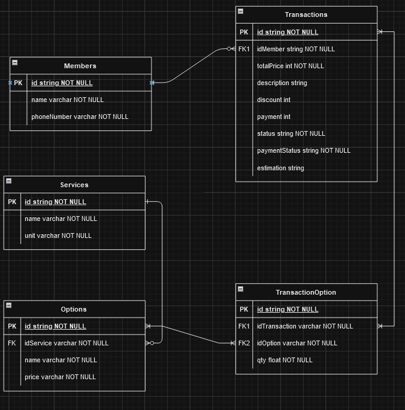

# LaundryApp API V1

An API for a laundry application.



## Table of Contents

- [Introduction](#introduction)
- [Features](#features)
- [Technologies Used](#technologies-used)
- [Installation](#installation)
- [Usage](#usage)
- [API Endpoints](#api-endpoints)

## Introduction

LaundryApp API V1 is a back-end API developed for a laundry application. This API allows users to manage members, define laundry services and service options, and create transactions associated with members that include multiple services and options.

In Version 2, users will be able to log in to their accounts to access their own organization, where their laundry data will be stored. Coming soon!

## Features

- **Add Organizations**: Add new laundry organization.
- **Add Users**: Add new users with username and password, related to an organization
- **Add Login and Logout Feature**: Securely authenticate and deauthenticate users.
- **Add Members**: Add new members by entering their name and phone number.
- **View Members**: Retrieve a list of all members.
- **Edit Members**: Update member details.
- **Delete Members**: Remove a member from the system.
- **Add Service**: Add new laundry services.
- **Edit Service**: Modify service details.
- **Delete Service**: Remove a service.
- **Add Service Option**: Add options to a specific service.
- **Edit Service Option**: Update service option details.
- **Delete Service Option**: Remove options from a service.
- **Add Transaction**: Create a transaction for a member, including multiple services and options.
- **View Transactions**: Retrieve a list of all transactions.
- **Edit Transactions**: Update transaction details.
- **Delete Transactions**: Remove a transaction from the system.

## Technologies Used

- Node.js
- Express.js
- MySql (Sequelize)

## Installation

To run this project locally, follow these steps:

1. **Clone the repository:**

   ```bash
   git clone https://github.com/AxelSeanCP/LaundryApp.git
   cd LaundryApp/Backend
   ```

2. **Install dependencies:**

   ```bash
   npm install
   ```

3. **Set up the database:**

   - Create a new MySQL database.
   - Run the database migrations:
     ```bash
     npx sequelize-cli db:migrate
     ```

4. **Configure environment variables:**

   - Create a `.env` file in the root directory.
   - Add the necessary environment variables:
     ```
     PORT=<your-port>
     ACCESS_TOKEN_KEY=<your-access-token-key>
     REFRESH_TOKEN_KEY=<your-refresh-token-key>
     ```

5. **Start the server:**

   ```bash
   npm run dev
   ```

## Usage

Once the server is running, you can interact with the API using tools such as Postman or cURL. Refer to the [API Endpoints](#api-endpoints) section for details on available routes.

## API Endpoints

### Organizations

- **Add an Organization**

  - `POST /organizations`
  - Request Body:
    ```json
    {
      "name": "string", // Lotus Laundry
      "password": "string"
    }
    ```

### Members

- **Add a Member**

  - `POST /members`
  - Request Body:
    ```json
    {
      "name": "string", // john doe
      "phoneNumber": "string" // 123456789
    }
    ```

- **Get all Members**

  - `GET /members`

- **Get Member by ID**

  - `GET /members/{id}`

- **Update a Member**

  - `PUT /members/{id}`
  - Request Body:
    ```json
    {
      "name": "string", // jane doe
      "phoneNumber": "string" // 987654321
    }
    ```

- **Delete a Member**
  - `DELETE /members/{id}`

### Services

- **Add a Service**

  - `POST /services`
  - Request Body:
    ```json
    {
      "name": "string", // wash and iron
      "unit": "string" // kg
    }
    ```

- **Get all Services**

  - `GET /services`

- **Update a Service**

  - `PUT /services/{id}`
  - Request Body:
    ```json
    {
      "name": "string", // towel
      "unit": "string" // pcs
    }
    ```

- **Delete a Service**

  - `DELETE /services/{id}`
    > deleting a service will delete all options related to the deleted service

- **Add a Service Option**

  - `POST /services/{idService}/options`
  - Request Body:
    ```json
    {
      "name": "string", // regular
      "price": "integer" // 10000
    }
    ```

- **Update a Service Option**

  - `PUT /services/{idService}/options/{idOptions}`
  - Request Body:
    ```json
    {
      "name": "string", // express
      "price": "integer" // 10000
    }
    ```

- **Get a Service with All Options**

  - `GET /services/{idService}`
    > will return options for selected service

- **Delete a Service Option**

  - `DELETE /service/{idService}/options/{idOptions}`

### Transactions

- **Add a Transaction**

  - `POST /transactions`
  - Request Body:
    ```json
    {
      "idMember": "string",
      "options": [
        {
          "idOption": "string",
          "qty": "float" //5.0
        }
      ],
      "description": "string", //10 piece
      "estimation": "string" //3 days
    }
    ```

- **Get all Transactions**

  - `GET /transactions`

- **Get Transaction by Id**

  - `GET /transactions/{id}`

- **Update a Transaction**

  - `PUT /transactions/{id}`
  - Request Body:
    ```json
    {
      "description": "string", //15 piece
      "payment": "integer", //25000
      "status": "string" //Done
    }
    ```

- **Delete a Transaction**

  - `DELETE /transactions/{id}`
